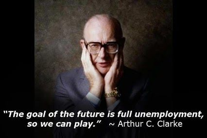

Using R and AWS S3 with S3mpi
========================================================
author: Robert Krzyzanowski
date: October 21, 2015

The problem
========================================================

Quick and iterative data science workflows require constant **sharing**
and **collaboration**.


The problem
========================================================

Quick and iterative data science workflows require constant **sharing**
and **collaboration**.

- Sending in-progress validation results
- Identifying records requiring munging or careful handling
- Storing reproducible research results

The problem
========================================================

Quick and iterative data science workflows require constant **sharing**
and **collaboration**.

- Sending in-progress validation results
- Identifying records requiring munging or careful handling
- Storing reproducible research results

Typical solutions are problematic:

- **Email**: Hard to track versioning, not great for large files.
- **Dropbox**: Requires careful bookkeeping of which folders are
  shared or may be prohibitive for large files.
- **SFTP**: Interrupts workflow, requires extensive command line
  interaction.


Introducing Amazon's S3
========================================================

- **Practically infinite** hard drive
- Lives on the cloud
- Stepping stone to "big data"
- Trivial collaboration / sharing with team


Connecting S3 to R
========================================================

http://github.com/robertzk/s3mpi

Rob's R session: 

```r
s3store(c(data = iris, label = "Iris), "iris")
```


Connecting S3 to R
========================================================

http://github.com/robertzk/s3mpi

Rob's R session: 

```r
s3store(c(data = iris, label = "Iris), "iris")
```
Tong's R session (1 second later):

```r
s3read("iris")
stopifnot(s3read("iris")$label == "Iris")
```

Connecting S3 to R
========================================================

http://github.com/robertzk/s3mpi

Rob's R session: 

```r
s3store(c(data = iris, label = "Iris), "iris")
```
Tong's R session (1 second later):

```r
s3read("iris")
stopifnot(s3read("iris")$label == "Iris")
```

No more `write.csv(iris, "~/tmp/datasets/iris_tmp2_final.csv")`.

Connecting S3 to R
========================================================

This works on **arbitrary R objects**!

Rob's R session: 

```r
s3store(function(skip, hop) skip + 2 * hop,
        "a_skip_and_two_hops"")
```

Connecting S3 to R
========================================================

This works on **arbitrary R objects**!

Rob's R session: 

```r
s3store(function(skip, hop) skip + 2 * hop,
        "a_skip_and_two_hops")
```
Tong's R session (1 second later):

```r
print(s3read("a_skip_and_two_hops")(1, 2))
# [1] 5
```

Connecting S3 to R
========================================================

"A sufficiently advanced S3 interface is indistinguishable
from magic." - Arthur C. Clarke

Possible to serialize **any object in memory**, including
external pointers to C structures.

Connecting S3 to R
========================================================

"A sufficiently advanced S3 interface is indistinguishable
from magic." - Arthur C. Clarke

Possible to serialize **any object in memory**, including
external pointers to C or Java structures.

Define an `s3mpi.serialize` attribute on your object:

* `write` key: Convert non-vanilla R object to vanilla object
* `read` key: Convert vanilla R object to non-vanilla object

*Hint*: Use `base::raw`.

*Note*: This works in production.

Connecting S3 to R
========================================================

```r
obj <- list(
  atomic_vector = 1:10, external_object = ptr_to_c_object)
attr(obj, "s3mpi.serialize") <- list(
  "write" = function(object) {
     obj$external_object <- convert_ptr_to_raw_vector(obj$external_object)
  },
  "read" = function(object) {
     obj$external_object <- convert_raw_vector_to_ptr(obj$external_object)
  })
```

The future
========================================================

- **Goal**: Automate our job so we can write math papers all day.
- "Understanding mathematics [data science] is not about complex abstract ideas,
   but about doing simple things well." — My advisor
- How much life can you save with as little code as possible?


